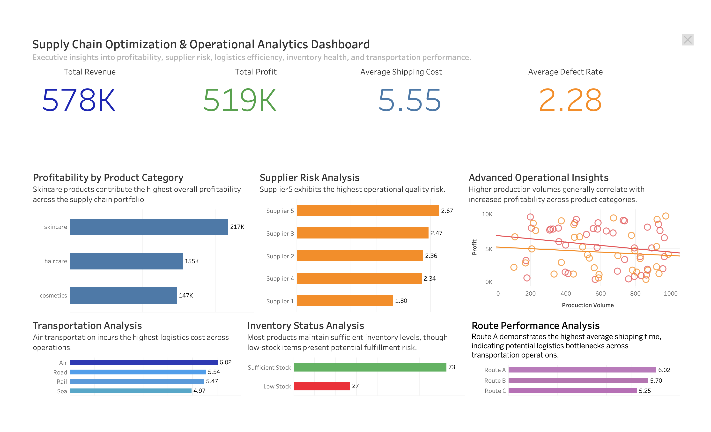

# Supply-Chain-Optimization-Analytics


---

## 📌 Project Overview

A global manufacturing company is facing rising logistics costs, supplier inefficiencies, inventory imbalance, and declining operational profitability. The objective of this project is to identify operational bottlenecks, evaluate supply chain performance, and recommend data-driven optimization strategies using SQL, Python, and Tableau.

This project simulates a real-world consulting analytics engagement focused on operational transformation and supply chain optimization.

---

## 📊 Dashboard Preview

The dashboard provides executive-level visibility into profitability, supplier risk, logistics efficiency, inventory health, and operational bottlenecks.



---

## 🎯 Business Problem

The organization is experiencing multiple operational challenges across its supply chain ecosystem:

Increasing transportation and logistics costs
Supplier quality inconsistencies
Inventory planning inefficiencies
Route-level delivery bottlenecks
Profitability imbalance across product categories

The goal of this project is to analyze operational data and identify opportunities to improve profitability, efficiency, and supply chain responsiveness.

---

## 🗂️ Project Structure

```bash
Supply-Chain-Optimization-Analytics/
│
├── data/
│   ├── supply_chain_data.csv
│   └── cleaned_supply_chain_data.csv
│
├── notebooks/
│   └── SupplyChain_EDA_Analysis.ipynb
│
├── sql/
│   └── Supply_chain_analysis.sql
│
├── tableau/
│   ├── dashboard.png
│   └── Supply_Chain_Dashboard.twbx
│
├── screenshots/
│
└── README.md
```

---

## 🛠️ Tech Stack

| Category | Tools & Technologies |
|---|---|
| **Languages** | Python, SQL |
| **Data Analysis** | Pandas, NumPy, SciPy |
| **Visualization** | Matplotlib, Seaborn, Tableau |
| **Notebooks** | Jupyter Notebook / JupyterLab |
| **Database** | PostgreSQL / MySQL |
| **Version Control** | Git, GitHub |
| **Environment** | Anaconda, virtualenv |

---

## 📈 Tableau Executive Dashboard

The Tableau dashboard was developed to provide executive-level visibility into operational performance across the supply chain network.

### Dashboard Features
- KPI Monitoring
- Profitability Analysis
- Supplier Risk Evaluation
- Transportation Cost Analysis
- Inventory Health Tracking
- Route Performance Monitoring
- Advanced Operational Scatter Plot Analysis

### Key Dashboard KPIs
- Total Revenue
- Total Profit
- Avg Shipping Cost
- Avg Defect Rate

---

## 📂 Dataset Information

The dataset contains operational and supply chain records including:

Product categories
Supplier performance
Transportation modes
Inventory levels
Manufacturing costs
Shipping performance
Route efficiency
Defect rates
Revenue generation

Dataset fields include:

product_type
revenue_generated
products_sold
stock_levels
supplier_name
shipping_costs
shipping_times
defect_rates
transportation_modes
routes
manufacturing_costs
production_volumes

---

## 📊 Key Analysis Areas

Project Workflow
1. Data Cleaning & Preprocessing

Performed data cleaning using Python:

Standardized column names
Removed inconsistencies
Checked missing values
Corrected data formats
Created derived metrics for operational analysis

2. SQL Business Analysis
Performed advanced SQL analysis to evaluate operational performance and identify business optimization opportunities.

Key Business Analyses & Insights

1. Profitability Analysis:
   
Objective
Identify the most profitable product category and investigate the operational drivers behind profitability.

Key Findings
Skincare products generated the highest profitability.
Skincare also showed the highest product sales volume.
Cosmetics products achieved the highest average pricing.
Cosmetics products also experienced the highest manufacturing costs and defect rates.

Business Insight
The skincare category emerged as the most profitable segment primarily due to stronger sales demand and operational efficiency. Although cosmetics products achieved premium pricing, elevated manufacturing costs and higher defect rates negatively impacted overall profitability margins.

Strategic Recommendation
Expand investment in high-performing skincare products.
Improve operational quality control for cosmetics manufacturing.
Reduce manufacturing inefficiencies and defect-related operational losses.

2. Supplier Risk Analysis:

Objective
Evaluate supplier-level operational risk and quality performance.

Key Findings
Supplier5 demonstrated the highest defect rate.
Supplier4 showed the highest manufacturing costs and the lowest operational efficiency.
Supplier3 experienced the highest lead times.
Supplier2 handled the highest production volume.

Business Insight
Operational risks were distributed across multiple suppliers rather than concentrated within a single entity. Supplier5 represented quality-related risk exposure, Supplier4 demonstrated process inefficiencies and elevated operational costs, Supplier3 contributed to logistics delays through longer lead times, while Supplier2 handled high operational load that may create scalability pressure.

Strategic Recommendation
Conduct supplier performance audits.
Improve supplier quality monitoring processes.
Optimize procurement and production workflows.
Diversify operational dependency across suppliers.

3. Transportation Analysis:
   
Objective
Analyze transportation performance across cost, delivery speed, and operational efficiency.

Key Findings
Air transportation incurred the highest shipping costs.
Road transportation achieved the lowest average shipping time.
Sea transportation demonstrated the highest operational efficiency.

Business Insight:
Air transportation generated the highest logistics costs without corresponding advantages in delivery speed or operational efficiency. Road transportation delivered the strongest responsiveness, while sea transportation achieved superior operational efficiency.

Strategic Recommendation:
Reduce unnecessary dependency on expensive air transportation.
Utilize road transportation for time-sensitive deliveries.
Leverage sea transportation for cost-efficient bulk operations.

4. Inventory Risk Analysis:
Objective
Evaluate inventory health and stock management efficiency.

Key Findings
73% of products maintained sufficient stock levels.
26% of products operated under low-stock conditions.
Skincare products demonstrated the highest inventory turnover.
Skincare products also maintained sufficient inventory availability.

Business Insight:
The skincare segment demonstrated strong demand performance while successfully maintaining inventory availability, indicating effective inventory planning and replenishment processes. However, low-stock products across other segments may expose the business to stockout risks and revenue leakage.

Strategic Recommendation
Improve demand forecasting for low-stock products.
Implement proactive inventory replenishment strategies.
Monitor high-turnover products to prevent stockout risk.

5. Route Performance Analysis:
Objective
Identify transportation route inefficiencies and logistics optimization opportunities.

Key Findings
Route A demonstrated the highest shipping time.
Route C incurred the highest shipping costs.
Route C also achieved the highest operational efficiency.

Business Insight:
Route A showed potential transportation bottlenecks and slower fulfillment responsiveness. In contrast, Route C generated higher logistics costs but simultaneously achieved superior operational efficiency, suggesting that elevated transportation expenses may be strategically justified for optimized route performance.

Strategic Recommendation
Optimize Route A logistics planning and transportation execution.
Continue utilizing Route C for high-priority operational flows.
Balance transportation cost against operational efficiency.

---

## 📈 Key KPIs Tracked

| KPI | Description |
|---|---|
| Total Revenue | Total revenue generated |
| Total Profit | Overall estimated profit |
| Avg Shipping Cost | Average transportation cost |
| Avg Defect Rate | Product quality indicator |
| Inventory Turnover | Inventory movement efficiency |
| Route Efficiency | Logistics performance metric |

---

## ⚙️ Getting Started

### Prerequisites
```bash
Python 3.9+
Jupyter Notebook
Git
```

### Installation

```bash
# Clone the repository
git clone https://github.com/vumang44-data/Supply-Chain-Optimization-Analytics.git

# Navigate to the project folder
cd Supply-Chain-Optimization-Analytics

# Install required libraries
pip install -r requirements.txt

# Launch Jupyter Notebook
jupyter notebook
```

---

## 💡 Key Business Insights

- 📌 Insight 1: Identified top bottlenecks in procurement cycle
- 📌 Insight 2: Inventory optimization opportunities across categories
- 📌 Insight 3: Demand forecasting accuracy improvements
- 📌 Insight 4: Vendor consolidation opportunities

---

## 🚀 Future Improvements

- Predictive demand forecasting using machine learning
- Supplier performance scoring model
- Transportation cost forecasting
- Inventory optimization simulation
- Real-time KPI dashboard integration

---

## 👤 Author

**Umang Verma**  
Data Analyst  

---

## 📄 License

This project is licensed under the **MIT License** — see the [LICENSE](LICENSE) file for details.

---
*⭐ If you find this project useful, please consider giving it a star!*

